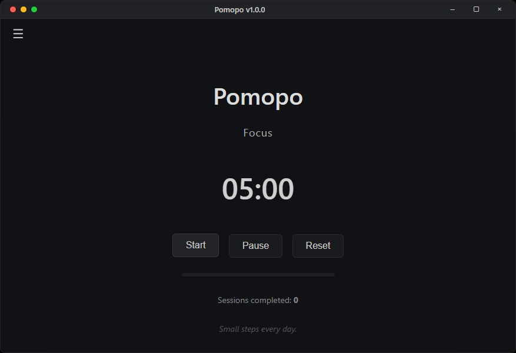
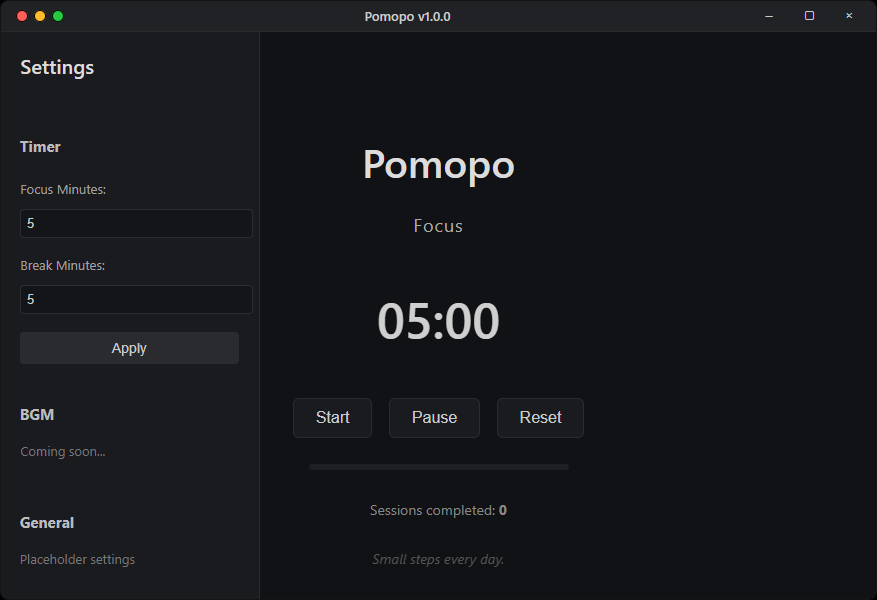

# Pomopo

  
  
  

Hey there! Pomopo is a little desktop app I built as a side hobby, to help you stay focused while studying or working.

---

## Screenshots

Here’s what it looks like when you actually open it:

  
  

---

## What It Does

- Lets you set focus and break timers to keep you on track  
- Shows encouraging quotes to keep you motivated  
- Built with Electron and Electron Forge, so it runs on Windows, Mac, and Linux  
- Frontend lives in `render/`, main process in `src/main.js`  
- Optional docs are in `doc/` if you want to dig deeper  

---

## License

Pomopo is under the ISC License. Check out the [LICENSE](LICENSE) file if you need the legal stuff.  

---
